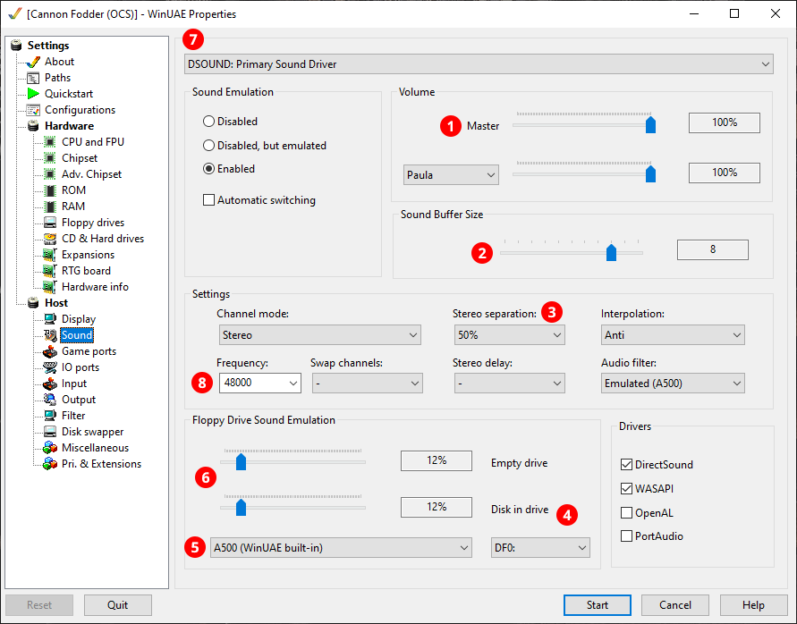

# Customising your setup

## Graphics customisation

To set a different scaling factor, use the drop-down to select a preset then
press the **Load** button. Unfortunately, this will also reset image centering
in the **Host / Display** tab (both will be enabled) and any manual image
centering settings (the GUI config tool can change only the scaling and leave
the centering settings alone).

These control the vertical and horizontal oversampling of the output image (a
larger image will be rendered then it will be downscaled; this increases image
quality). **2x** horizontal and **3x** vertical are recommended for the best
results. Going above this will yield extremely minor improvements but can
overtax your GPU.

If you have a really weak GPU that can't keep up (e.g., the screen updates are
choppy and/or you're getting audio dropouts), try **1x** horizontal and **2x**
vertical which should be about three times faster. Note this setting could
result in faint vertical interference patterns (moire patterns) when using
non-integer scaling factors with the PAL shader. If your GPU can't even handle
**2x** vertical scaling, you will get horrible vertical interference patterns
in almost all content, so you should disable the CRT emulation altogether.

### Disabling CRT shaders

Set this to **Point Prescale** to disable the CRT shaders; this will make the
pixels appear as sharp little rectangles (which is completely inauthentic).
This shader works best with **3x**/**3x** oversampling (higher values even out the
pixels a bit more). You'll also want to disable ReShade by quitting WinUAE and
renaming `dx11.dll` to `dx11.bak` in `$RML_BASE\WinUAE`. If you want to
re-enable CRT emulation later, restore the `.dll` extension of this file, the
restore the appropriate shader (**CRT-A2080-PAL** or **CRT-A2080-NTSC**) and
oversampling factors.

## Input customisation

TODO

## Sound customisation

You can customise the sound settings in the **Host / Sound** tab.

- **1** -- Adjust the **Master Volume**.

- **2** -- You can try to decrease the **Sound Buffer Size** for lower input latency and
  better audio-to-video sync, but too low settings might result in audio
  drop-outs and glitches.

- **3** -- The Amiga has four output channels hard-panned to left and right.
  The default **Stereo Separation** of 50% gives you a pleasant
  experience on headphones by mixing 50% of the left channels into the right
  channels and vice versa. You might want to set this to 100% (no crossfeed)
  if you're using speakers, or fine-tune the stereo separation to your
  liking.

- **4** -- Show/adjust **Floppy Drive Sound Emulation** settings for this drive.

- **5** -- You can adjust the floppy drive sound volume here for
  the drive selected with **6**.

- **6** -- Select **No sound** here to disable floppy sound for the selected
  drive.

- **7** -- Sound driver to use. **DSOUND** gives a good performance on
  most systems, but you might want to experiment with **WASAPI** or **WASAPI
  EX** if you want to achieve the lowest possible latency.

- **8** -- **Sample rate** of the sound emulation. This should be left at
  48000 (48 Khz) unless your audio device only supports 44.1 kHz, in which
  case change it to 44100.
