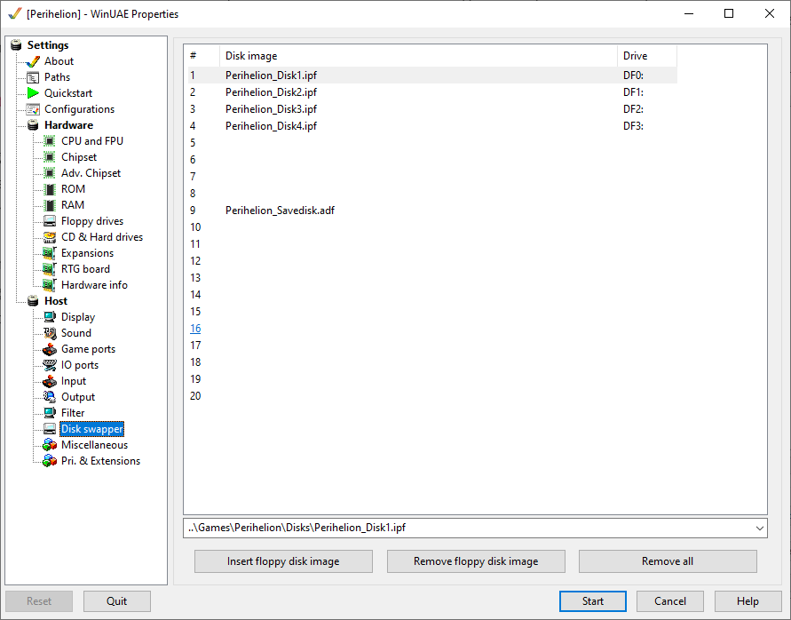

# Floppy games

All Amigas come with one floppy drive as standard equipment, but they can be
optionally expanded with up to four drives. The first floppy drive is called
**DF0:** (**D**rive **F**loppy **0**), the second **DF1:**, the third
**DF2:**, and the fourth **DF3:**.

Most floppy games are in the **IPF** format (Interchangeable Presentation
Format), and some are in the **RAW** (KryoFlux CT-RAW) format. These are
accurate representations of the original disks with the copy protection
intact.

A handful of games might be only provided as regular **ADF** files (Amiga Disk
File). These games either don't use disk-based copy protection or are only
available in cracked form at the time being.

## Single-disk games

All floppy game configurations have the first floppy pre-inserted in drive
**DF0:** (the first floppy drive). For single-disk games, that's all you need
(e.g., [Dungeon Master](../game-notes/d.md#dungeon-master-v36), **Midwinter** and
[Exile (OCS)](../game-notes/e-f.md#exile-ocs)).

## Speeding up loading times

You can speed up floppy loading times considerably by entering "warp mode".
You can toggle warp mode with ++end+pause++. This "time-warps" the speed of
the emulation to the maximum your computer can handle, so you are going
"faster than real-time". There is no sound if warp mode is engaged and the
emulated CPU speed meter is pegged to 100% in the [on-screen
display](getting-started.md#on-screen-display).

!!! warning

    Note for people who know enough about WinUAE to be dangerous: *never*
    increase the floppy emulation speed of WinUAE as that will break most
    disk-based copy protections. It might initially seem that all is fine, but
    many games *do not* advertise when they fail the protection checks! They
    will casually let you keep playing but put the game silently into an
    unwinnable state.

    Warp mode works 100% reliably because it speeds up the whole emulated
    computer, not just the floppy drive separately from the rest of the
    system.

!!! tip "ProTip(tm)"

    If you know what you're doing, you can create a [Save
    states](save-states.md) right after the game finishes loading. You can
    save this as a new config and use it to start the game instantaneously.

## Multi-disk games

Multi-disk games fall into two categories: some support multiple floppy
drives, some only a single drive. The best-case scenario is when a game
supports as many drives as the number of disks it comes on. Such games are
configured with the game disks pre-inserted into the drives (e.g., the
two-disk game **Lemmings**, or the four-disk games
[Perihelion](../game-notes/p.md#perihelion), [Hook](../game-notes/g-j.md#hook), and
[Soccer Kid (OCS)](../game-notes/s.md#soccer-kid-ocs)).

The other scenario is that the game supports *fewer* drives than the number of
disks it has (e.g., a two-disk game supporting a single drive, or a four-disk
game supporting two drives). In these games, you'll need to swap the disks
when the game prompts you. Fortunately, WinUAE has a convenient disk swapper
feature to make this easy:

- Press ++end+1++ to ++9++ to insert floppy number 1 to 9 into drive
  DF0: (the first floppy drive).

- By default, the disk swapper targets the first floppy drive. To insert a
  floppy into one of the other three drives, you'll need to select the target
  drive with ++end+lctrl+1++ to ++4++ first.

For example:

- To insert the second game disk into drive DF0: (first drive), press ++end+2++.

- To insert the third game disk into drive DF1: (second drive) next, press
  ++end+lctrl+2++ to select the second drive as the target for the disk
  swapper, then ++end+3++ to insert the third disk.

- To insert the fourth game edisk into DF0: again, press ++end+lctrl+1++
  followed by ++end+4++ .

You can view the disk swapper configuration for the currently loaded game
config in the **Host / Disk swapper** configuration tab of the WinUAE
settings window.

!!! warning "Patience is still a virtue"

    Usually, you'll need to wait about two seconds after inserting a disk into
    a floppy drive until the Amiga recognises it. So, for example, if a game
    instructs you to insert "disk 2" into DF0:, press ++end+2++, then wait a
    few seconds until the floppy drive makes the recognisable "floppy
    acknowledged" sound. Pay attention to the emulated floppy drive
    sounds---you'll learn what to listen for in no time.

!!! warning "Not all keyboards are created equal"

    You might not be able to use some of the drive selection shortcuts
    (++end+lctrl+1++ to ++4++) if you do not have a *3-key rollover* (3KRO) or
    better keyboard.

## Workbench

Most floppy games start automatically when you launch their configs, but
some need to be started manually from the Workbench screen.

See the [Workbench](hard-drive-games.md#workbench) section of hard drive
installed games for further details (most of the information applies to floppy
games as well).

## Saving your progress

Some games give you continuation codes at certain checkpoints, while others
let you save your progress to disk whenever you want. Some other games don't
have any built-in continuation or save support---luckily, you can use WinUAE
[Save states](save-states.md) with these.

### Save disks

Many floppy games support saving your progress to disk. Usually, you need to
prepare a special **save disk** for this purpose, and the instructions to do
so vary per game. For your convenience, all games that support saving your
progress to disk include a blank save disk in the 9th disk swapper slot (so
you can insert it by pressing ++end+9++).

If you want to reset your save disk, a blank save disk is also included in a
ZIP archive in the `Savedisk` subfolder within the game folder. Just extract
this ZIP file into the `Disks` folder, overwriting the existing disk image,
and your save disk will be reset (of course, only do this when WinUAE is not
running).

Some games ask you to enter a full path of your save file, e.g.,
`DF0:MySave1`, or you might need to enter `DF0:` and press enter to list
the save games on the floppy in the first drive. Make sure *not* to leave the
colon off from **DF0:** in such scenarios. The trailing colon signals that
we're dealing with a drive, not just a file called **DF0**. This is similar to
the **C:** drive in Windows.

!!! warning "Not all blank disks are created equal"

    Always use the save disk included with the game. A regular empty AmigaDOS
    ADF disk image won't work with games that use special encoding schemes
    (e.g., [Cannon Fodder (OCS)](../game-notes/c.md#cannon-fodder-ocs)). If you
    want to reset your save disk, use the included blank save disk from
    the ZIP archive in the `Savedisk` folder.

!!! tip "ProTip(tm)"

    If you know what you're doing, you can create your own save disks. You'll
    probably need to consult the game's manual to do so as the exact steps
    vary per game (e.g., you might need to set a specific disk label).

    Always use **Extended ADF** images save disks. These images are about
    2 MB in size. The regular 880 KB ADF images will give you problems in some
    games, and you'll invariably only realise this when it's already too late
    and you've lost your progress...

### Saving to the game disk

Some games save your progress or high scores directly to the game disk (e.g.,
[Pinball Dreams](../game-notes/p.md#pinball-dreams) and [Rogue: The Adventure
Game](../game-notes/q-r.md#rogue-the-adventure-game)). These games are configured
to never modify the original floppy images, but create a so-called **save
image** instead which contains the changes compared to the original disk. Save
images have the `.save_adf` file extension and are located in the `Disks`
folder within the game folder.

Do the following if you wish to revert a such "virtually modified" game disk
to its pristine original state:

- First, make sure the game is not running (restarting WinUAE is the safest
  bet).
- Go to the **Hardware / Floppy drives** configuration tab in the WinUAE
  settings window.
- Click on the **Delete save image** button (usually next to the **DF0:**
  button).
- Make sure to untick the **Write protected** checkbox on the same drive to
  recreate a blank save image.

!!! warning

    Don't forget to untick the **Write protected** checkbox after deleting the
    save image! Some games won't even start if the game disk is
    write-protected.

!!! tip "ProTip(tm)"

    Of course, the resourceful among you can create several copies of these
    save images to emulate multiple save points in games that only support a
    single save slot. Make sure to only make copies of the save images or
    restore them from your backups when WinUAE is shut down (so never while
    the game is running).
