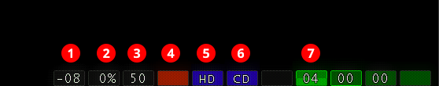

# Getting started

!!! danger "HALT! --- No one shall pass before reading this first!"

    If you've never used an Amiga before, you will _not_ get very far without
    reading this getting started section. You will probably not even make it
    past the intro of your very first game!

    So please **read these instructions _very carefully!_**

    Seasoned Amiga veterans who know the Amiga inside out should also keep
    reading as half of the information is emulation-related.

Starting a game

: Start the bundled portable Amiga emulator called **WinUAE** by running
  `winuae.exe` (creating an icon for it on your desktop is a good idea). This
  should bring up the configurations tab. You can always return to the
  configurations tab by selecting :material-numeric-1-circle:{: .circ-num}
  **Configurations** in the left pane.

    

    Once you're in the configurations tab:

    - Make sure **Games\\** is selected in the :material-numeric-2-circle:{: .circ-num}
      **Filter** drop-down. 

    - To start a game, double-click on its name in the
      :material-numeric-3-circle:{: .circ-num} list (note that some games
      might take a bit of time to load).

    - To narrow down the list, start typing into the
      :material-numeric-4-circle:{: .circ-num} search box. Click on the **X**
      button next to search field to clear the search filter.

    - If you want to play a different game, it's best to quit WinUAE with
      ++alt+f4++ then start it again.

    Alternatively, you can load a config by single clicking on it and
    then pressing the :material-numeric-5-circle:{: .circ-num} **Load** button.
    You can see the name of the currently loaded config in the
    :material-numeric-6-circle:{: .circ-num} title bar. Now click on
    :material-numeric-7-circle:{: .circ-num} **Start** to launch the game.

    !!! important 

        You _must_ press **Load** before pressing **Start**, otherwise WinUAE
        will use the _last_ loaded config, or the default one if you
        haven't loaded a config yet... which won't do anything!

Read the game notes
: Always check the [Game notes](../games/index.md) before trying a game for
  the first time. A few titles need some extra steps to even just start the
  game---this could be hard to figure out if you've never used an Amiga
  before. Some of this advice is next to impossible to figure out on your own
  (you'll need a lot of forum diving to find all this info), or the
  information is in the manual but it's hard to find.

Skipping code checks
: Some games have additional special configs to skip the intro or the
  manual-based copy protection check at the start (e.g., `Altered Destiny
  [skip code check]`). It's advised to start the normal config for the first
  time to experience the intro and the original game at least once.

Use warp mode
: You can speed up floppy loading times considerably by entering "warp mode".
  This "warps" the speed of the emulation to the maximum your computer can
  handle. You can toggle warp mode with ++end+pause++ (there is no sound in
  warp mode and the emulated CPU speed meter is pegged to 100% on the
  on-screen display).

Meet the on-screen display
: The on-screen display (OSD) in the bottom-right corner is a handy little
  thing that gives you feedback about what the emulator is doing (in addition
  to the emulated floppy drive sounds).

    

    - :material-numeric-1-circle:{: .circ-num} **Audio buffer** utilisation meter
    - :material-numeric-2-circle:{: .circ-num} **CPU** utilisation meter (it's
    pegged to **100** in warp mode)
    - :material-numeric-3-circle:{: .circ-num} **FPS** meter (shows the letter **P** if the emulation is paused; jumps up to the 200-300+ FPS range in warp mode)
    - :material-numeric-4-circle:{: .circ-num} **Power LED** of the emulated Amiga (usually blinks a few times if a program crashes before the machine reboots automatically)
    - :material-numeric-5-circle:{: .circ-num} **Hard disk** activity LED (blue on reads, red on writes)
    - :material-numeric-6-circle:{: .circ-num} **CD-ROM** activity
    - :material-numeric-7-circle:{: .circ-num} **Floppy drive** activity of
    the four floppy drives (green on reads, red on writes; the number
    indicates the current track). The first drive is always present
    (except on the CDTV and the CD32), the rest are optional.

Read the manuals

: It's important to understand that control schemes and user interfaces were a
  lot less standardised in the 1980s and early 90s. You won't get very far in
  most games without reading the manuals, the reference cards, and other
  supplementary materials first. Look for these in the **Manual** and
  **Extras** sub-folders within the game folders.

    The **Manual** folder contains *not* just the manual, but any other items
    included with the original game that are necessary for playing and
    completing the it (e.g., code wheels, code sheets, or other documents
    and images you might need to refer to as a form of copy protection).

    The **Extras** folder contains optional content not strictly necessary to
    complete the game (e.g., covers, posters, official hint books, etc.).

Floppy games
: [Hard drive installed games](hard-drive-games.md) are the easiest to deal
  with, floppy games need a bit of practice. Read the [Floppy games](floppy-games.md)
  section for guidance. You can easily recognise a floppy game by the emulated
  floppy drive sounds.

Controller support
: Most games in the collection are controlled with the mouse and the keyboard,
  but a few need a joystick. These games are configured for an emulated
  joystick: use the regular cursor keys (not the numeric keypad) for movement,
  and the ++ralt++, ++rshift++, or ++rctrl++ keys for the fire button.

  To use a real joystick, press the fire button on your joystick after
  starting the game. This will "plug" the joystick into either port 1 or port
  2 of your "virtual Amiga", depending on which fire button you pressed. Most
  games look for the joystick in port 2, so you might need to use the
  ++end+j++ **Swap joysticks** hotkey.

  Many CDTV or Amiga CD32 games are best played with the mouse, but some are
  almost unplayable without a gamepad. To use your controller (e.g., an Xbox
  360), press the green **A** button on it after starting the game and WinUAE
  will "plug it" into port 2.

Learn the keyboard shortcuts
: There are few important [keyboard shortcuts] you should familiarise yourself
  with. The three most important are ++pause++ to toggle pausing the
  emulation, ++end+f12++ to switch between windowed and full windowed mode,
  and ++end++pause++ to toggle warp mode. ++f12++ stops the emulation and
  brings up the WinUAE GUI, but don't touch anything there yet if you're a
  newbie; things will blow up :explosion: :fire:. Just press ++esc++ or the
  **Ok** button for now to return to the game.

Saving your progress
: When it comes to saving your game progress, it's a bit of a Wild West
  situation. Every game is slightly different, and floppy games that require
  dedicated save disks are the trickiest. But fear not, help is provided on
  the [Game notes](../games/index.md) page for these titles. Make sure to read
  the detailed [Saving your progress](floppy-games.md/#saving-your-progress)
  section as well for general tips, and don't forget about [Save
  states](save-states.md) as an alternative saving option.

Customising your setup
: If you're a power user, you should consider configuring the games for proper
  vertical syncing (vsync) for the best results. TODO This is an advanced topic
  detailed in the [Graphics customisation](customising-your-setup.md#graphics-customisation)
  section.

Learn more about Amiga games
: Check out the [Useful websites](useful-websites.md) page to find out more
  about Amiga games. These sites should also help you decide which titles to
  try next.
