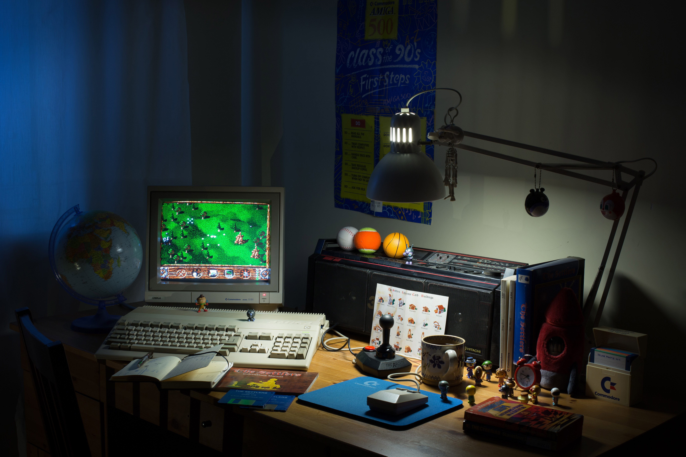

# Introduction

Welcome **RML Amiga** (**R**incewind's **M**agic **L**uggage Full of Amiga
Goodies), a curated collection of (mostly) cerebral Amiga games! Adventures,
RPGs, simulators, strategy, board and puzzle games are the stars of the show,
but a small number of arcade classics have also been included.

The aim of this collection is to recreate the Original Authentic Experience™
of sitting in front of a real Commodore Amiga connected to a classic 15 kHz
Commodore CRT monitor, playing the uncracked and unaltered originals. Manuals,
reference cards, interactive code wheels, maps, posters, box art, audio
recordings, hint books, and various other extras to enjoy the games to the
fullest are all included.

No previous Amiga experience is assumed or required---things are kept as
simple as possible, and everything you need to know is explained in this
manual.

Wait a minute, you said "uncracked originals"? Does this mean I'll need to use
floppies and put up with disk swapping and long loading times? No! Contrary to
popular belief, the majority of big multi-disk releases are hard drive
installable. Luckily for us, that's most RPGs and adventure games.

About 70% of the games in the collection run from an emulated hard drive. Most
of the remaining floppy games require either no disk swapping (because they
support multiple drives), or only minimal disk swapping. Moreover, most
floppy-only releases load rather quickly, and you can always put the emulator
in "warp mode" to speed up the loading.

<figure markdown>
  
  <figcaption>Typical home setup from the 1990s of an Amiga 500 equipped with a Commodore RGB monitor, running the all-time strategy classic The Settlers (<a href="https://www.forgottencomputer.com/retro/beauty_shots.html">source</a>).</figcaption>
</figure>

## Features in detail

Authentic experience
: Every single game has been painstakingly set up for an optimal and
  authentic experience. The primary goal is to run unaltered originals on the
  systems they were developed for, which is a stock or expanded Amiga 500 for
  most titles. A small number of titles run on an emulated Amiga 1200, Amiga
  CD32, or Commodore CDTV.

Native hard drive installations
: Hard drive installations are preferred for games that natively support it.
  That's most big American releases, and many European RPG, adventure, and
  strategy titles. Also, quite a few games that don't have official HD
  installers can be persuaded to run from a hard drive with a little Amiga
  knowledge. 70% of the games in the collection run from the hard drive.

No more bad cracks
: An overarching theme of the collection is "no hacks allowed!" For games
  designed to run from floppies, the original floppy images are preferred with
  the disk-based protection intact. Cracks, hacks, WHDLoad, and other fan-made
  content are generally avoided and are only used as a last resort. For the
  rare cracked versions every effort was taken to confirm the game is
  completable. No more worrying about bad cracks in those 40+ hour RPGs!

Optimal configurations
: Some games benefit from faster CPUs or extra memory (e.g., they might show
  more varied graphics or have more music and sound effects in the presence of
  extra RAM). Then some games assume very specific configurations and start
  exhibiting strange bugs if their expectations are not met. Figuring this out
  for each game is tricky as it requires in-depth Amiga knowledge or manual
  and forum diving---usually all of the above, and this can be tedious even
  for Amiga gurus. The good news is you don't have to worry about any of that;
  all games have been configured to give you the most the they have to offer.

Play floppy games like a boss
: Every floppy game comes pre-configured to use multiple floppy drives if the
  game supports it. This means zero or vastly reduced disk swapping. Blank
  save disks are also provided for each game as creating them is often tedious
  and error-prone (some games use special save disk formats).

Authentic CRT monitor emulation
: Pixel art drawn and intended to be viewed on 15 kHz Commodore CRT monitors
  looks outright broken on modern flat screen with the pixels displayed as
  razor sharp little rectangles. A CRT shader setup is included that
  authentically recreates the look of PAL and NTSC Commodore monitors people
  typically used their Amigas with.

PAL/NTSC & aspect ratio correctness
: All games are correctly set up for PAL or NTSC, including the getting aspect
  ratio right while prioritising developer intent. No more playing American
  releases with squashed graphics and 20% slower music or gameplay! Moreover,
  PAL games that assume "NTSC stretch" are correctly set up, too (these are
  typically Atari ST ports and some European multi-platform releases).

Quality-of-life save states
: Some games subject you to a manual-based protection check at startup, or
  have an unskippable intro sequence, or might take a really long time to load
  from floppies. For these games, the collection provides save states taken
  right after the protection check or the intro as a quality-of-life
  enhancement. One less excuse for using questionable cracks and hacks!

All necessary information included
: Manuals, reference cards, interactive code wheels, maps, posters, box art,
  audio recordings, hint books, and various other extras to enjoy the games
  to the fullest are all included. Quite a few games are next to impossible to
  play without these materials. Significant effort has been taken to track
  down the best-looking scanned copies for each game.

Preserving custom Workbench screens
: A handful of games feature beautifully designed icons and Workbench screens
  with custom colour schemes (Workbench is the graphical user interface of
  AmigaOS). These works of art are worth preserving, and to date RML Amiga is
  the only games collection that attempts to do so.

Curated demoscene collection
: The Amiga was (and still is) famous for its vibrant demoscene in Europe.
  Demos are non-interactive audiovisual pieces of art created by Amiga
  enthusiasts (traditionally teenagers) that showcase their coding and
  artistic prowess and push the limits of what the machine is capable of. Many
  elite level programmers and artists of today had been forged in the fires of
  the early Amiga demoscene. The collection includes a modest selection of
  demos, with the goal of eventually including all demos presented in the
  prestigious [editions64k](https://www.editions64k.fr/) Amiga demoscene book
  series by ... and then some more!

## Hardware requirements

RML Amiga has been developed and tested on Windows 10 64-bit. It will most
likely work fine on more recent Windows versions, and probably on Windows 7
64-bit too. Only 64-bit Windows versions are supported.

The CRT shader setup is optimised for 1080p monitors (1920&times;1080
resolution), but should work on any display. A variable refresh rate (VRR),
adaptive-sync display (e.g., Nvidia G-Sync or AMD FreeSync capable) is highly
recommended. Fixed-refresh rate monitors will work fine too, but it can be a
bit more hassle to minimise input lag in action games with vsync enabled on
such displayes. If you only care about slower-paced games (e.g., RPGs,
adventures) and watching demos, a fixed-refresh monitor will work great.

A middle-tier or better CPU released in the last ten years or so is
recommended. A dedicated GPU is recommended but integrated graphics adapters
will most likely work too, just you might need to lower the CRT shader quality
(see the [customising your setup](customising-your-setup.md) section for details).

## On copyright and ethics

All games in this collection have been out of commercial circulation for at
least three decades. If it wasn't for the exemplary efforts of the [Software
Preservation Society (SPS)](https://www.softpres.org/) (formerly known as the
**Classic Amiga Preservation Society (CAPS)**) and the larger Amiga community,
all those original floppy disks would be unreadable by now and 99% of these
games would be lost forever.

The goal of this collection is *not* to advocate piracy or to strip creators
of their livelihood, but to make these games not available via any commercial
channels accessible and playable for old school Amiga fans and the next
generation of gamers alike.

For this reason, the collection will *never* include any recent Amiga games
that are still sold commercially. This is to respect their creators and is
non-negotiable.

The collection is supposed to be shared freely; selling it for profit is
considered extremely bad taste and is in no way endorsed by the creators of
RML Amiga. **Don't do this!**

All games in the collection are copyright of their respective owners. 

