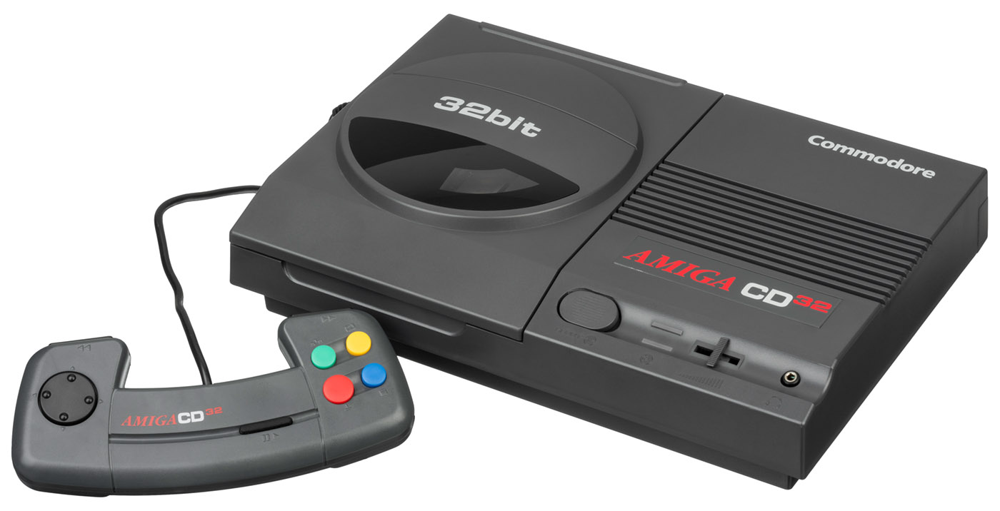
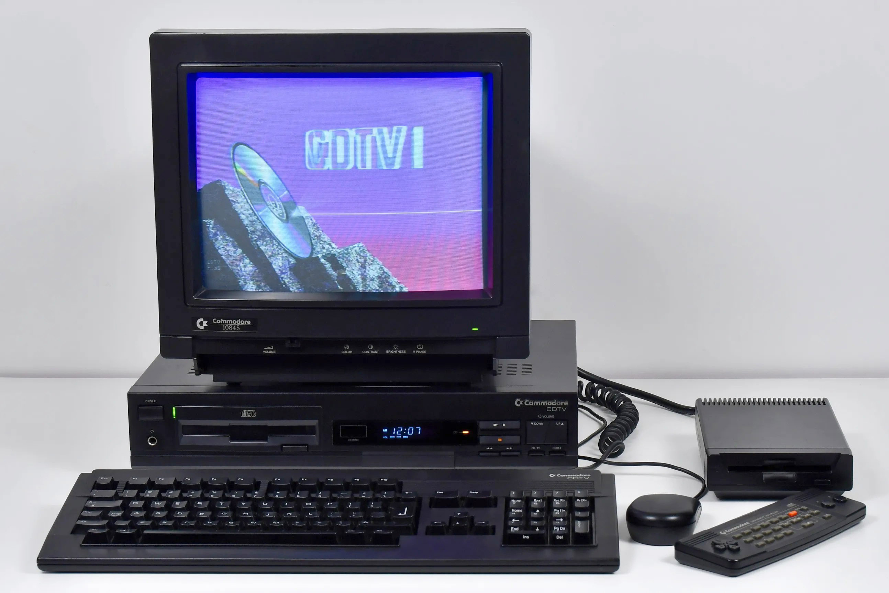
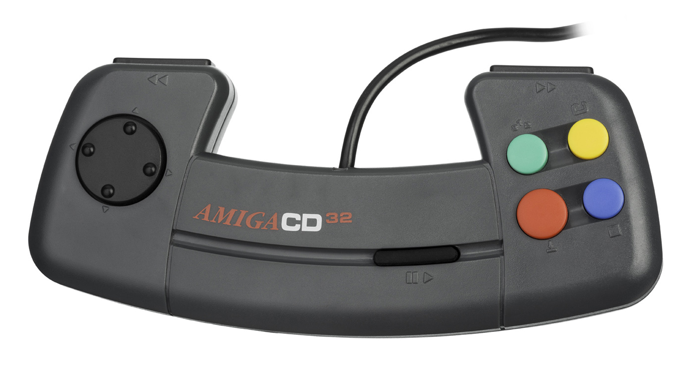
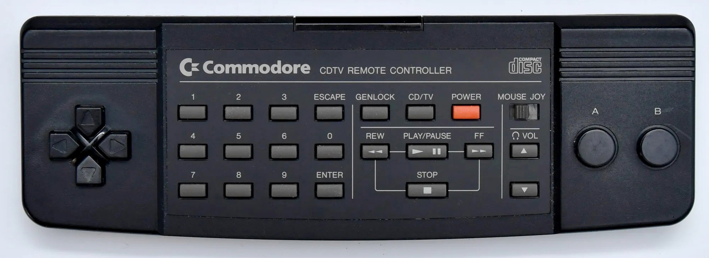

# CDTV and Amiga CD32 games

The **CDTV** (Commodore Dynamic Total Vision) and **Amiga CD32** were CD-ROM
game consoles based on the Amiga 500 and Amiga 1200 models, respectively. An
interesting trivia is that the Amiga CD32 was the world's first 32-bit
CD-based console (if we don't count the Japan-exclusive FM Towns Marty
released a few months earlier).

These Commodore consoles were not very successful, but a few games have really
cool CD release exclusive content (e.g., CD Audio in-game music in
[Heimdall 2: Into the Hall of Worlds](../game-notes/g-j.md#heimdall-2-into-the-hall-of-worlds-cd32),
voice acting and a tutorial section in
[Battle Chess](../game-notes/b.md#battle-chess-cd32), and there are a handful of
CD-exclusive titles as well, such as
[Defender of the Crown II](../game-notes/d.md#defender-of-the-crown-ii-cd32) and
[Pirates! Gold](../game-notes/p.md#pirates-gold-cd32)).

<figure markdown="span">
  
  <figcaption>Amiga CD32 and the included game controller</figcaption>
</figure>

<figure markdown="span">
  
  <figcaption>A fully decked-out Commodore CDTV with all optional peripherals and a special black Commodore 1084S monitor</figcaption>
</figure>

## Gamepads

Most CDTV and Amiga CD32 games are meant to be played with the gamepad that
came with the console. It's best to use a physical game controller with these
games as the keyboard mappings for the emulated gamepad can be rather awkward.

To use your physical gamepad (e.g., an Xbox 360 controller), press the green
**A** button on it after starting the game and WinUAE will auto-plug it into
port 2. If you're using some other game controller, press the button that is
in the same location as the **A** button on the Xbox 360 controller. Similarly
to joysticks, you might need to activate the **Swap joystick ports** feature
with ++end+j++ if your gamepad was auto-plugged into the wrong port.

A smaller number of CDTV and CD32 games support the mouse as well and some
even the keyboard (these peripherals were available as optional accessories).
Although you can play these games (typically point-and-click adventures) with
a gamepad, it's usually more convenient to use the mouse.

<figure markdown="span">
  
  <figcaption>Amiga CD32 controller</figcaption>
</figure>

<figure markdown="span">
  
  <figcaption>Commodore CDTV controller</figcaption>
</figure>

## Saving your progress

### NVRAM

Similarly to other consoles, a stock CDTV or CD32 does not have any floppy or
hard drive drives for data storage, only a small built-in battery-backed
memory called the **NVRAM**. Most CDTV and CD32 games will give you either
continuation codes or let you save your progress to the NVRAM.

On real hardware, all your games must share the NVRAM built into the console,
and this often leads to problems (e.g., running out of space because the NVRAM
is rather small). To avoid this issue, all CD-based games in the collection
are configured to use their own dedicated NVRAM (the files with the `.nvr`
extension in the `NVRAM` folder in the game folders).

!!! tip "ProTip(tm)"

    Similarly to [save disks](floppy-games.md#save-disks), you can create
    several copies of the NVRAM files if you want to keep more saves than what
    a single NVRAM can store. Make sure to only make copies of the NVRAM files
    or restore them from your backups when WinUAE is shut down (so never while
    the game is running).

### Save states

Some CD games might only support a limited number of save slots when saving to
the NVRAM, or only allow you to save at specific in-game locations (e.g.,
**Frontier II: Elite (CD32)**). Then in some games, the save feature is rather
buggy (e.g., [Heimdall 2: Into the Hall of
Worlds](../game-notes/g-j.md#heimdall-2-into-the-hall-of-worlds-cd32)).

You can sidestep these limitations and issues by ignoring the in-game save
feature altogether and using [Save states](save-states.md) instead. Save
states are fully compatible with all CD games. Mixing NVRAM saves and WinUAE
save states usually works fine, but you might want to use save states
exclusively for extra safety.

### Hard disk

A small number of CD-based games also allow you to save to a hard disk, which
is an optional accessory for the CDTV and CD32. If available, this is your best
option, but hard disk support is rather rare in CD games. The
[Game notes](../game-notes/index.md) specifically mention such games.

!!! danger

    Do not mix hard disk saves with save states in CD-based games; you might
    lose your progress or corrupt your hard disk saves if you do so.
