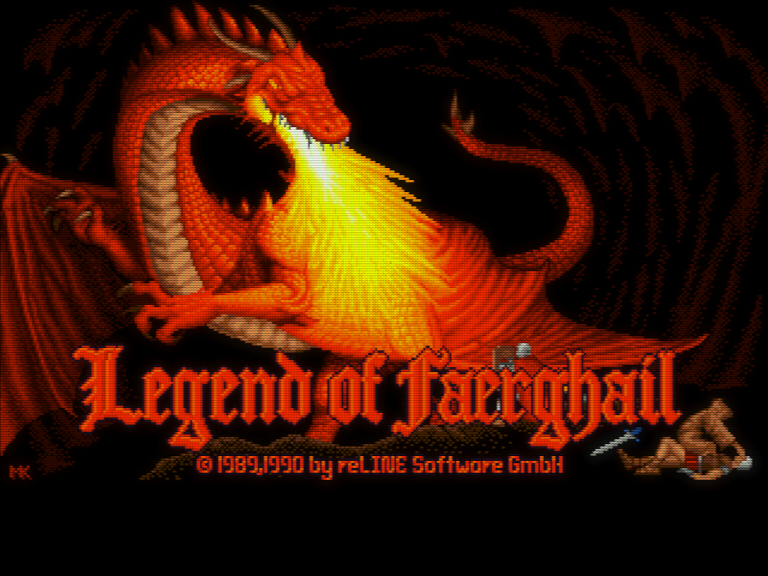
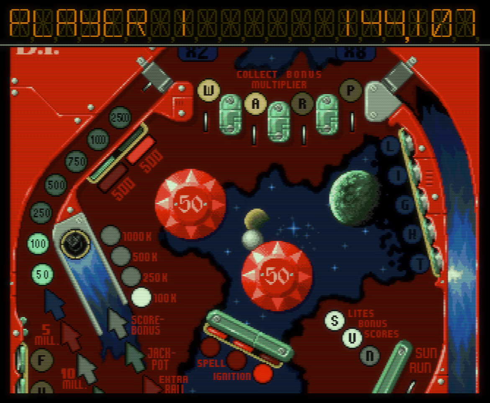

# CRT emulation

CRT shaders, sharp pixels, black borders around the image---these are very
divisive topics in emulation circles, and the default graphics settings of RML
Amiga might not suit your preferences. That's fine, we're all a bit different.
Rest assured, you can customise these settings to your liking, including
turning off the CRT emulation altogether. But it's worthwhile to understand
the reasoning behind the defaults first before you change anything.

Out-of-the-box, RML Amiga emulates the output of a 15 kHz Commodore CRT
monitor. Most people used their Amigas with such monitors in the 1980s and 90s
(e.g., the iconic **Commodore 1084S** or the **Philips CM8833-II]**)[^1]. The
default 3.0x scaling mimics the physical dimensions of such 14" CRTs
rather closely on 24 to 27" widescreen desktop displays. Just grab a ruler and
measure the diagonal of the image in an NTSC game; it will be about 13" (33 cm)
on a 24" screen which is close to the diagonal of the viewable area on a
typical 14" CRT.

So what, you might think. We have bigger and better monitors now, so why
not make the best of them and let the image fill the screen completely? Well,
because arguably that wouldn't be the "best" thing to do.

From a normal 1 to 1.5-meter viewing distance, the relatively small screen
size of a 14" monitor combined with the beneficial smoothing effects of CRTs
produced an image that looked very smooth and strangely higher resolution than
it really was. The CRT took off the edges of the "pixels" and added a subtle
texture to the image (CRTs don't have "pixels", but that's a longer story).
The perceived quality of 320&times;200 Amiga games on Commodore monitors
rivalled the experience of 640&times;480 games on much sharper PC CRT
monitors. Sure, the Amiga's image was a bit blurrier and lacked fine detail, but
it was _nowhere near_ the extreme blockiness of how PC monitors presented
320&times;200 content! People moving on from the Amiga to the PC in the
1990s often complained about low-resolution pixel art suddenly looking
overly blocky on their 14--15" PC monitors.[^2]

Let me stress this again: 320&times;200 content on the Amiga was _smooth_, not
blocky as on the PC! On well-made art, the "pixels" literally melted away; you
did not see jagged stairstep edges but smooth curves! 

<figure markdown="span">
  
  <figcaption>Legend of Faerghail (PAL, 3.0x scaling) (click on the image
  to enlarge it)</figcaption>
</figure>

That's all good and well, but some games still look subjectively better with
the graphics slightly enlarged. For example, I like playing [Pinball Dreams]()
with 3.5x scaling so it almost completely fills the screen; it's just more
immersive for me that way. So by all means, feel free to to adjust the image
size depending on your display size, viewing distance, and personal
preference. You might also want to use different scaling factors for different
games. The [Customising your setup](customising-your-setup.md) section shows
you how to do that.

Be aware, however, that as you start deviating from the "canonical" 14" CRT
image size (3.0x scaling factor), you will start seeing the "pixels". The
beneficial blur of the CRT emulation will also be enlarged, resulting in a
subjectively less sharp-looking image. You can offset this by using the
"sharp" variants of the shaders; these will reduce the blurriness
substantially, but at the expense of the beneficial smoothing effects---the
pixels will start looking blockier. Moreover, the scanlines will be more
apparent at higher scaling factors, too, especially with the NTSC shader. You might
want to force the PAL shader even in NTSC games to mitigate this as that
renders more "densely packed" scanlines.

<figure markdown="span">
  
  <figcaption>Pinball Dreams (PAL, overscan, 3.5x scaling) (click on the image
  to enlarge it)</figcaption>
</figure>

As you can see, deviating from the canonical 14" CRT image size is all about
tradeoffs. Even on real CRT monitors, the experience is not the same on larger
17" to 21" displays. You just need to pick what's more important to you:
authenticity and image quality, or image size and getting rid of the "black
borders".

This is certainly a fascinating topic; you can read more about it [in my
article](https://blog.johnnovak.net/2022/04/15/achieving-period-correct-graphics-in-personal-computer-emulators-part-1-the-amiga/)
that describes the CRT emulation setup of RML Amiga in detail.

[^1]: The most popular Amiga model ever, the Amiga 500, had built-in RGB
    output but no aerial RF or composite connectivity to hook it up to a
    TV. There was a composite-compatible monochrome connector labeled **Mono**
    at the back of the machine, but doesn't count; nobody wanted to use their
    Amigas with a black and white TV. So people were faced with a simple
    choice: either buy the Commodore 1084S or similar RGB monitor with
    built-in speakers (this costed about 60-70% of the price of the Amiga 500), or
    purchase the RF adapter add-on which let you use your machine with a TV.
    The problem was the RF adapter still costed a non-negligible amount of
    money (about 25% of the price of the monitor) and had terrible image
    quality. Parents were not exactly thrilled with the prospect of their kids
    hogging the family TV all day, so most wanted to get their kids a
    dedicated display. Put it that way, the choice between a proper RGB monitor or a
    much worse quality small TV and an RF adapter became a no-brainer as the
    cost was about the same. Another stopgap solution was to use a special RGB
    to SCART cable with a SCART-equipped small TV, but the results were not as
    good (the horizontal resolution on a TV is a lot lower, so you could not
    read 80-column text easily). Plus you could not control your kid's TV
    watching habits if they had their own in their room.

[^2]: This is due to the fundamental design differences between Commodore and
    IBM PC CRT monitors. Commodore monitors such as the 1084S were effectively
    small high-quality TV sets with RGB input. Commodore was after the home
    computer and enthusiast market (at least in the beginning), so they found
    a way to effectively repurpose cheap small TVs into RGB monitors at an
    affordable price! These small-TVs-turned-monitors had great image quality,
    much better than your usual small TV, but their resolution and sharpness
    didn't come anywhere near specialised IBM PC monitors. PC monitors were
    the kings of sharpness, optimised for staring at spreadsheets all day at
    work, but they lacked the qualities of "lesser" CRTs that put pixel art in
    a more favourable light. Being squarely aimed at the business market, they
    were several times more expensive than 15 kHz home computer monitors in
    the 1980s.

