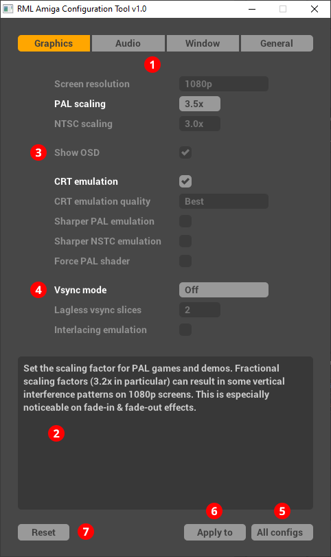

# Customising your setup

You can customise your RML Amiga game configurations in two ways:

- By using the special [Configuration tool](#configuration-tool). This is the
  simplest and safest method, therefore it's the recommended way for most
  users. The tool also allows you to apply bulk changes to multiple or all
  configs at once.

- By making changes to the configs in the WinUAE settings window directly. The
  benefit of this approach is that you can customise every aspect of the
  emulation --- only a small subset of these possibilities is exposed in the
  config tool. The drawback is it's fairly easy to screw things up if you're
  not an expert WinUAE user and you cannot apply bulk changes to multiple
  configs this way.

!!! warning "You break it, you keep it"

     The direct method is reserved for experts and experts only. You'll lose
     your warranty the moment you start tinkering with the game configs with
     the direct WinUAE method. If you've screwed up one of your game configs,
     just [restore the original config](troubleshooting.md/#restoring-configs)
     and try again --- maybe by using the config tool this time.

## Configuration tool

RML Amiga includes a configuration tool aptly titled `ConfTool.exe` located in
your `$RML_BASE/Tools` folder. You might want to create a desktop shortcut for
it.

The tool allows you to change specific settings of your configs while leaving
the rest alone (e.g., turn off the floppy sounds, set a larger graphics
scaling factor, use windowed mode by default, etc.)

The tool has a simple single-window interface:

<figure markdown="span">
  { align=center }
</figure>

- Config settings are organised into categories; you can switch between them
  with the radio button :material-numeric-1-circle:{: .circ-num} at the top of
  the window.

- The lower part of the window :material-numeric-2-circle:{: .circ-num} shows
  the description of the setting currently under the mouse pointer. Make sure
  to read these descriptions carefully before you change anything.

- You'll need to create a "plan" for your configuration changes, then you can
  apply this "change plan" to one or more configs. By default, every setting
  is greyed out (like this one :material-numeric-3-circle:{: .circ-num}).
  Greyed out settings will not be modified when you apply the "change plan".
  If you want to modify a setting, you'll need to enable it first by clicking
  on its name which will highlight it :material-numeric-4-circle:{: .circ-num},
  then you can change its value. If you've changed your mind and
  don't want to modify that setting, click on it again to make it greyed out
  (disabled).

- You can specify whether you want to apply the config changes to **All**
  configs, or only to the **Games** or the **Demos** with the
  :material-numeric-5-circle:{: .circ-num} drop-down next to the **Apply**
  button.

- Press **Apply** to :material-numeric-6-circle:{: .circ-num} apply the
  changes to the selected config category.

- Alternatively, you can drag and drop config files onto the config tool
  window to apply the changes to a single config only or to a set of configs.
  A confirmation dialog will appear listing the names of the configs the
  changes will be applied to.

- You can reset the "change plan"   by pressing the **Reset** button
  :material-numeric-7-circle:{: .circ-num}. This will reset all settings to
  their defaults and will make them greyed out (disabled).

## 4K and better monitors

If you have a 4K or better monitor (3840&times;2160 or higher resolution), you
can improve the authenticity of the CRT emulation by doing the following:

  - Go to the `$RML_BASE\WinUAE` folder
  - Delete `RGB-CRT.ini`
  - Make a copy of `RGB-CRT-4k.ini` and rename it to `RGB-CRT.ini` (make sure
    to get the filename right; it's best to copy-paste it from here)

It's the vertical resolution of your monitor that matters; if it's 2160
pixels or higher, then you should do this.

Conversely, if you're going back to a 1440p or 1080p screen, replace
`RGB-CRT.ini` with `RGB-CRT-1080p.ini`.

!!! note "Automated installer note"

    If you used the [automatic installation
    method](installation.md/#automatic-installation) to set up RML Amiga, this
    step has already been done for you by the installer.

## Scaling customisation

The **Screen resolution** setting in the configuration tool effectively
applies additional scaling on top of **PAL scaling** / **NTSC scaling**:

| Screen resolution | Additional scaling |
| ---               | ---                |
| 1080p             | 1.00x              |
| 1440p             | 1.33x              |
| 2160p (4K)        | 2.00x              |
| 2880p (5K)        | 2.66x              |

For example, **2160p (4K)** screen resolution and **3.5x** PAL scaling will
result in 2.0 &times; 3.5 = 7.0 scaling for PAL games.

Choosing a matching screen resolution setting for your monitor is a good idea
if you want to minimise pillar and letterboxing around the image. However, if
you want to emulate close to period-authentic image sizes and gain
finer-grained control over scaling, consider choosing a lower resolution
setting (i.e., **1440p** on a 4K monitor, which is my preference). Read [CRT
emulation](crt-emulation.md) for more details.

## DCI-P3 colorspace support

If you have a DCI-P3-capable wide-gamut monitor, running the [CRT
emulation](crt-emulation.md) in DCI-P3 mode will give you superior results
(deeper blacks, increased contrast, and more vivid colours that are much
closer to a real CRT).

Make sure your monitor is set to DCI-P3 mode, then do the following:

  - Go to the `$RML_BASE\WinUAE` folder
  - Delete `RGB-CRT.ini`
  - Make a copy of `RGB-CRT-1080p-DCI-P3.ini` or `RGB-CRT-4k-DCI-P3.ini` and
    rename it to `RGB-CRT.ini` (make sure to get the filename right; it's best
    to copy-paste it from here)

The Windows desktop and most Windows programs assume sRGB, so in DCI-P3 they
will appear oversaturated. The best way to fix this is to use a utility that
will only enable DCI-P3 mode when WinUAE is active. **ClickMonitorDCC** is one
of the best utilities for the job.

In **ClickMonitorDCC**, navigate to the **Auto-Run commands** tab in the
settings, select `winuae64.exe` as the program, tick the **Only in
full-screen** checkbox, and enter the [DCC
command](https://en.wikipedia.org/wiki/Display_Data_Channel) to enable DCI-P3
mode on your monitor.

You'll need to do some research to find this out, e.g., for the DELL U2725QE,
the command for enabling DCI-P3 is `setVCP 0xf0 10`. You can use
[softMCCS](https://entechtaiwan.com/lib/softmccs.shtm) to find out all the VCP
commands supported by your monitor. You'll probably need to experiment with
the manufacturer-specific commands.

Alternatively, you can use [TwinkleTray](https://twinkletray.com/), but that
doesn't support auto-sending VCP commands based on the active window. In
**TwinkleTray**, you can find all VCP codes supported by the display under
**DDC/CI Features** in the program's settings.

!!! danger "Malware danger!"

    Make sure to download **ClickMonitorDCC** from reputable sources! The
    project's original website is no longer active, but you can still download
    the program from safe, trusted mirrors:

    

      - [https://github.com/chrismah/ClickMonitorDDC7.2](https://github.com/chrismah/ClickMonitorDDC7.2)
      - [https://www.majorgeeks.com/files/details/clickmonitorddc.html](https://www.majorgeeks.com/files/details/clickmonitorddc.html)
      - [https://www.softpedia.com/get/System/System-Miscellaneous/ClickMonitorDDC.shtml](https://www.softpedia.com/get/System/System-Miscellaneous/ClickMonitorDDC.shtml)

    

    If you simply do a web search for "ClickMonitorDCC", you'll see polished,
    convincing-looking websites in the top results that claim they're the
    continuation of the project. Upon deeper inspection, you'll find these are
    AI-generated slop websites --- _do NOT trust them; it's almost certain they
    contain malware that can steal your personal data or harm your computer!_
