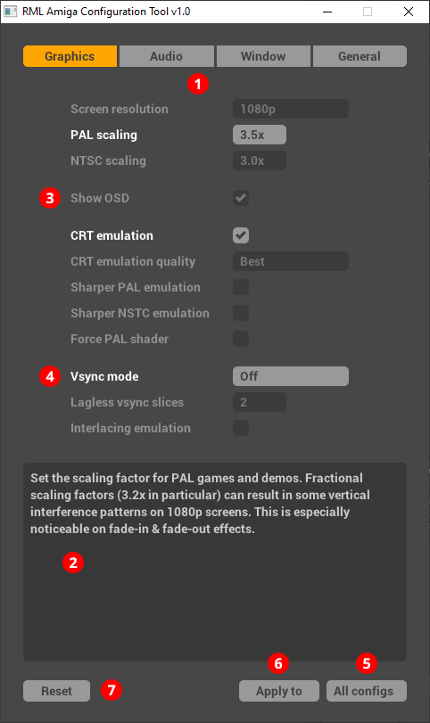

# Customising your setup

You can customise your RML Amiga game configurations in two ways:

- By using the special [Configuration tool](#configuration-tool). This is the
  simplest and safest method, therefore it's the recommended way for most
  users. The tool also allows you to apply bulk changes to multiple or all
  configs at once.

- By making changes to the configs in the WinUAE settings window directly. The
  benefit of this approach is that you can customise every aspect of the
  emulation---only a small subset of these possibilities is exposed in the
  config tool. The drawback is it's fairly easy to screw things up if you're
  not an expert WinUAE user and you cannot apply bulk changes to multiple
  configs this way.

!!! warning "You break it, you keep it"

     The direct method is reserved for experts and experts only. You'll lose
     your warranty the moment you start tinkering with the game configs with
     the direct WinUAE method. If you've screwed up one of your game configs,
     just restore the stock config and try again---maybe by using the config
     tool this time.

## Configuration tool

RML Amiga includes a configuration tool aptly titled `ConfTool.exe` located in
your `$RML_BASE/Tools` folder. You might want to create a desktop shortcut for
it.

The tool allows you to change specific settings of your configs while leaving
the rest alone (e.g., turn off the floppy sounds, set a larger graphics
scaling factor, use windowed mode by default, etc.)

The tool has a simple single-window interface:

<figure markdown="span">
  { align=center }
</figure>

- Config settings are organised into categories; you can switch between them
  with the radio button :material-numeric-1-circle:{: .circ-num} at the top of
  the window.

- The lower part of the window :material-numeric-2-circle:{: .circ-num} shows
  the description of the setting currently under the mouse pointer. Make sure
  to read these descriptions carefully before you change anything.

- You'll need to create a "plan" for your configuration changes, then you can
  apply this "change plan" to one or more configs. By default, every setting
  is greyed-out (like this one :material-numeric-3-circle:{: .circ-num}).
  Greyed-out settings will not be modified when you apply the "change plan".
  If you want to modify a setting, you'll need to enable it first by clicking
  on its name which will highlight it :material-numeric-4-circle:{: .circ-num},
  then you can change its value. If you've changed your mind and
  don't want to modify that setting, click on it again to make it greyed-out
  (disabled).

- You can specify whether you want to apply the config changes to **All**
  configs, or only to the **Games** or the **Demos** with the
  :material-numeric-5-circle:{: .circ-num} drop-down next to the **Apply**
  button.

- Press **Apply** to :material-numeric-6-circle:{: .circ-num} apply the
  changes to the selected config category.

- Alternatively, you can drag and drop config files onto the config tool
  window to apply the changes to a single config only or to a set of configs.
  A confirmation dialog will appear listing the names of the configs the
  changes will be applied to.

- You can reset the "change plan"   by pressing the **Reset** button
  :material-numeric-7-circle:{: .circ-num}. This will reset all settings to
  their defaults and will make them greyed-out (disabled).

