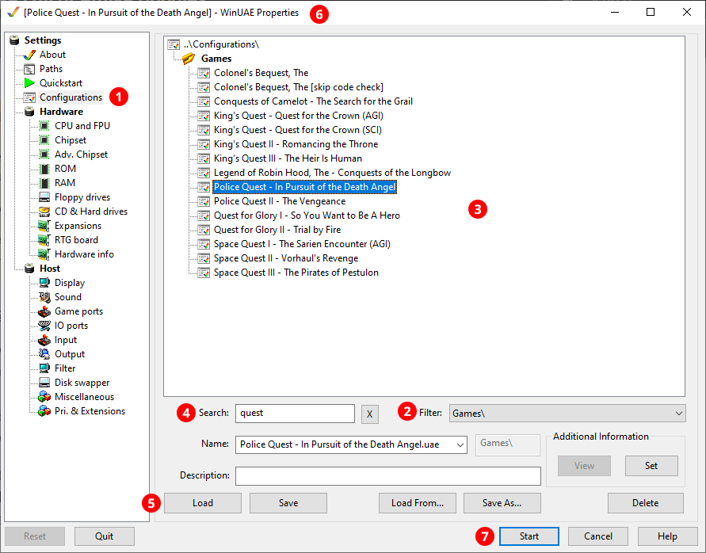

# Getting started

!!! danger "HALT! --- No one shall pass before reading this first!"

    If you've never used an Amiga before, you will _not_ get very far without
    reading this getting started section. You will probably not even make it
    past the intro of your very first game!

    So please **read these instructions _very carefully!_**

    Seasoned Amiga veterans who know the Amiga inside out should also keep
    reading as half of the information is emulation-related.

### Starting a game

Start the bundled portable Amiga emulator called **WinUAE** by running
`winuae.exe` (creating a desktop shortcut icon for it would be a good idea).
WinUAE always shows the configuration tab after startup. You can return to the
configurations tab from any other tab by selecting
:material-numeric-1-circle:{:.circ-num} **Configurations** in the left pane,
or by just simply restarting WinUAE.

Once you're in the **Configurations** tab:

  - Make sure **Games\\** is selected in the :material-numeric-2-circle:{: .circ-num}
    **Filter** drop-down. 

  - To start a game, double-click on its name in the
    :material-numeric-3-circle:{: .circ-num} configurations list. Note some
    games might take a bit of time to load.

  - To narrow down the list, start typing into the
    :material-numeric-4-circle:{: .circ-num} **Search** box. Click on the **X**
    button right of the text field to clear the search filter.

  - If you want to play a different game, it's best to quit WinUAE with
    ++alt+f4++ and then start it again.

Alternatively, you can load a configuration by single-clicking on it and then
pressing the :material-numeric-5-circle:{: .circ-num} **Load** button. You can
see the name of the currently loaded config in the
:material-numeric-6-circle:{: .circ-num} title bar. After having loaded the
config, click on the :material-numeric-7-circle:{: .circ-num} **Start** button
to launch the game.

!!! important 

    You _must_ press **Load** before pressing **Start**, otherwise WinUAE
    will use the _last_ loaded config, or the default one if you haven't
    loaded a config yet... which won't do anything!

### User manual

The latest version of the user manual you're reading now is available on the
[RML Amiga website](https://rml-amiga.johnnovak.net/). Make sure to read it in
its entirety to get the most out of the collection. A local version that you
can read without an internet connection is included in the **Documentation**
folder of your RML Amiga installation. Just double-click on `index.html` in
that folder and the manual will open in your default browser. The full-text
search in only available in the online version.

### Game notes

Always check the [Game notes](../game-notes/index.md) before trying a game for the
first time. A few titles need some extra steps to even just start the
game---this could be hard to figure out if you've never used an Amiga before.
Some of this advice is next to impossible to figure out on your own (you'd
need to do a lot of forum diving to find it), or the information is included
in the manual but it's easy to miss if you don't read it carefully.

### Skipping code checks

Some games have additional special configs to skip the intro or the
manual-based copy protection check at the start of the game (e.g., `Altered
Destiny [skip code check]`). It's advised to start the normal config for the
first time to experience the intro and the original game at least once.

### Warp mode 

You can speed up loading times (especially floppy loading times) considerably
by entering "warp mode". You can toggle warp mode with ++end+pause++. This
"time-warps" the speed of the emulation to the maximum your computer can
handle, so you are going "faster than real-time". There is no sound if warp
mode is engaged and the emulated CPU speed meter is pegged to 100% in the
on-screen display.

### On-screen display

The on-screen display (OSD) in the bottom-right corner is a handy little thing
that gives you feedback about what the emulator is currently doing.

  

  - :material-numeric-1-circle:{: .circ-num} **Audio buffer** utilisation
    meter (if this turns red and you hear distorted audio, you'll need to
    increase the audio buffer sizes with the configuration tool)

  - :material-numeric-2-circle:{: .circ-num} **CPU** utilisation meter (it's
    pegged to **100** in warp mode)

  - :material-numeric-3-circle:{: .circ-num} **FPS** meter (shows the letter
    **P** if the emulation is paused; jumps up to the 150-300+ FPS range in
    warp mode)

  - :material-numeric-4-circle:{: .circ-num} **Power LED** of the emulated
    Amiga (usually blinks a few times if the machine reboots automatically
    because of a program crashing)

  - :material-numeric-5-circle:{: .circ-num} **Hard disk** activity LED
    (blue on reads, red on writes; only shown for hard drive games)

  - :material-numeric-6-circle:{: .circ-num} **CD-ROM** activity (only shown
    for CD32 and CDTV games).

  - :material-numeric-7-circle:{: .circ-num} **Floppy drive** activity of
    the four floppy drives (green on reads, red on writes; the number
    indicates the current track). The first drive is always present (except on
    the CDTV and the CD32), the rest are optional.

### Manuals

It's important to understand that control schemes and user interfaces were a
lot less standardised in the 1980s and early 90s. You won't get very far in
most games without reading the manuals, the reference cards, and other
supplementary materials first. Look for these in the **Manual** and **Extras**
sub-folders within the game folders.

The **Manual** folder contains *not* just the manual, but any other items
included with the original game that are necessary for playing and completing
it (e.g., code wheels, code sheets, or other documents and images you'll need
to refer to during your playthrough as a form of copy protection).

The **Extras** folder contains optional content not strictly necessary to
complete the game (e.g., covers, posters, maps, hint books, etc.).

### Floppy games

[Hard drive games](hard-drive-games.md) are the easiest to deal with, floppy
games need a bit of practice. Read the [Floppy games](floppy-games.md) section
for guidance. You can easily recognise a floppy game by the emulated floppy
drive sounds.

### Controller support

Most games in the collection are controlled with the mouse and the keyboard,
but a few need a joystick. These games are configured for an emulated
joystick: use the regular cursor keys (*not* the numeric keypad) for movement,
and the ++ralt++, ++rshift++, or ++rctrl++ keys for the fire button.

To use a real joystick, press the fire button on your joystick after starting
the game. This will "plug" the joystick into either port 1 or port 2 of your
"virtual Amiga", depending on which fire button you press. Most games look
for the joystick in port 2, so you might need to use the ++end+j++ **Swap
joysticks** hotkey if the joystick doesn't work.

Many CDTV or Amiga CD32 games are best played with the mouse, but some are
almost unplayable without a gamepad. To use your controller (e.g., an Xbox 360
controller), press the green **A** button on it after starting the game and
WinUAE will automatically "plug" it into port 2.

### Keyboard shortcuts

There are a few important [Keyboard
shortcuts](../appendices/keyboard-shortcuts.md) you should familiarise
yourself with. The three most important are ++pause++ to toggle pausing the
emulation, ++end+pause++ to toggle warp mode, and ++end+f12++ to switch
between windowed and full windowed mode. ++f12++ stops the emulation and
brings up the WinUAE GUI, but don't touch anything there yet if you're a
newbie; things will blow up! :bomb::fire: Just press ++esc++ or the **OK** or
**Cancel** button for now to return to the game.

### Saving your progress

When it comes to saving your game progress, it's a bit of a Wild West
situation. Every game is slightly different, and floppy games that require
dedicated save disks are the trickiest to deal with. But fear not, help is
provided on the [Game notes](../game-notes/index.md) page for these titles. Make
sure to read the detailed [Saving your
progress](floppy-games.md/#saving-your-progress) section as well for general
tips, and don't forget about [Save states](save-states.md) as an alternative
saving option.

### Game variants

A few games have some abbreviations after their names in parenthesis, e.g.,
**Eye of the Beholder (AGA)** and **Eye of the Beholder (OCS)**. These specify
which variant of the game we're dealing with if multiple different releases
exist. Here's a quick rundown of them:

- **OCS** --- This stands for Original Chip Set, which is the graphics chip
    of the original Amiga line (such as the Amiga 500). About 90% of all
    Amiga only have an OCS version, so if the game has no other variants, OCS
    is simply omitted from the name.

- **AGA** --- Later Amigas (Amiga 1200, 4000, and the CD32) had the Advanced
    Graphics Architecture chipset capable of displaying more colours on the
    screen. As AGA games are relatively rare, they always have the AGA suffix
    in their name.

- **CDTV**, **CD32** --- These denote CD games for the [two ill-fated Amiga
    consoles](cdtv-and-cd32-games.md). As these are even rarer than AGA games,
    they all have the CDTV or CD32 suffix.

Generally, the collection only contains the best version of the games, unless
the different versions offer something unique, in which case all are included.
This is usually the case with later AGA and CD32 re-releases that feature
different (but not necessarily better) graphics and in some cases a CD Audio
soundtrack or other CD-only extras.

### Customising your setup

RML Amiga comes with defaults that aim to recreate the experience of sitting
in front of a real Amiga in the 1980s. Some other technical settings have been
carefully chosen to ensure all games run without issues on most people's
setups. However, power users might want to tweak these settings for a better
experience (e.g., to enable lagless vsync with the minimum possible input
latency).

If you would like to change the defaults (e.g., you'd like to make the image
fill the screen, or turn off the CRT shaders or the floppy sounds) or want to
fine-tune the technical emulator settings, please refer to the [Customising
your setup](customising-your-setup.md) section.

### Further reading

Check out the [Useful websites](../appendices/useful-websites.md) page to find out more
about Amiga games. These sites should also help you decide which titles to try
next.
