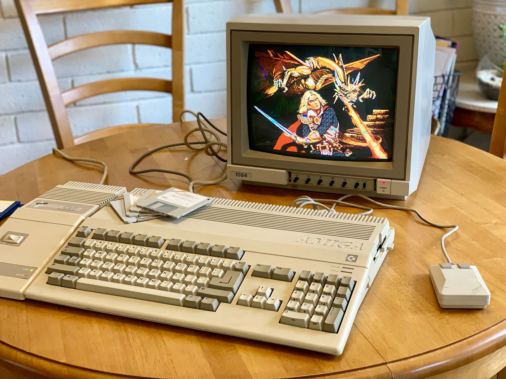
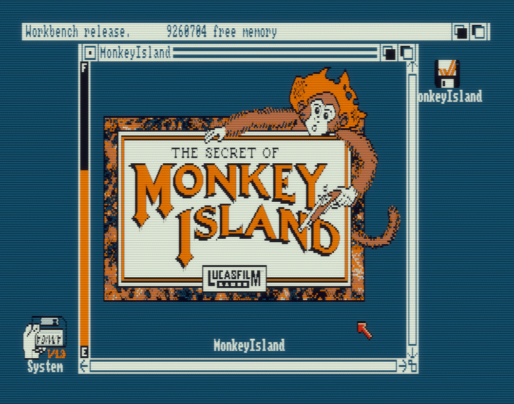

# Hard drive games

Hard drive installed games are the easiest to deal with. First of all, they
load much faster than floppy games and you don't need to swap disks. Secondly,
most of these games can save your progress to the hard drive, so you don't
need to deal with save disks.

Most of the big multi-disk adventure games and RPGs, especially the ones
developed by American studios, are hard drive installable. Then a good number
of games that don't have official hard drive installers can be still run
cleanly from a hard drive by employing a few simple tricks. It's important to
note that none of these tricks involve modifying the game's executable or data
files---such hacks are not allowed in RML Amiga.

<figure markdown="span">
  
  <figcaption>Amiga 500 equipped with the popular GVP A500-HD+ hard drive side
  expansion running Pool of Radiance</figcaption>
</figure>

## Hard drive basics

The first hard drive is called **DH0:** (**D**rive **H**ard **0**), the second
**DH1:**, and so on. These are analogous to the **C:** and **D:** drives on
Windows. Most hard drive games in the collection use a two hard
drive configuration:

- **DH0:** contains a heavily stripped-down AmigaOS---just the bare minimum
  necessary for running games. This drive has the **System** label.

- **DH1:** contains the game itself and usually has the label **Game**, but
  this can vary (e.g., **ChampionsOfKrynn**, **PopulousII HD**, **LEGEND.0**,
  etc.). This drive is mapped to the `Harddisk` folder inside the game folder,
  which is just a regular folder; you have full access to its contents from
  Windows. This is handy if you want to back up your save games or to transfer
  your characters in RPG series.

A small number of games that need very specific AmigaOS setups only use a
single **DH0:** drive which contains both the OS and the game.

## Workbench

Most hard drive games start automatically when you launch their configs, but
some need to be started manually from the so-called **Workbench** screen.

One of the reasons why some games don't start automatically is because they
have additional icons to start the game with different options (e.g.,
[King's Quest: Quest for the Crown (SCI)](../game-notes/k-l.md#kings-quest-quest-for-the-crown-sci)),
or to run extra programs included with the game, such as level editors (e.g.,
[SimCity Collection](../game-notes/s.md#simcity-collection)).

The other reason is that a handful of games feature beautifully designed icons
and Workbench screens with custom colour schemes. These works of art are worth
preserving, and to date, RML Amiga is the only game collection that attempts
to do so.

Here are some good custom Workbench examples:

  - [The Secret of Monkey Island](../game-notes/s.md#secret-of-monkey-island-the)
  - [Legend of Faerghail](../game-notes/k-l.md#legend-of-faerghail)
  - [Pirates!](../game-notes/p.md#pirates)
  - [Art of GO, The](../game-notes/a.md#art-of-go-the)
  - [Battle Chess (OCS)](../game-notes/b.md#battle-chess-ocs)
  - [Champions of Krynn](../game-notes/c.md#champions-of-krynn)
  - [Death Knights of Krynn](../game-notes/d.md#death-knights-of-krynn)

<figure markdown="span">
  
  <figcaption>The Secret of Monkey Island Workbench start icon</figcaption>
</figure>

## Saving your progress

Most hard drive games store the save games on the hard drive; using the
in-game save and restore functionality is usually straightforward in such
games (but in some, the save game menu is a bit hidden; make sure to consult
the game's manual if you can't find it). If a game asks you to select the
location of your save file and lets you use any location, you should use the
**DH1:** drive unless the [Game notes](../game-notes/index.md) instruct you
otherwise.

There are some outliers, though. A handful of games insist on saving to a
floppy disk even when installed on the hard drive (e.g.,
[Future Wars](../game-notes/e-f.md#future-wars-adventures-in-time)).
Then some RPGs save the "state of the world" to the data files as you keep
progressing through the game, so starting a new game with a new character
requires a full reinstall ([Amberstar](../game-notes/a.md#amberstar) and
[Demon's Winter](../game-notes/d.md#demons-winter) are such games).

The [Game notes](../game-notes/index.md) contain detailed instructions for these
special snowflakes---make it a habit to always check these notes before
playing a new game.

!!! danger "Patience is a virtue"

    _Never ever_ reset the emulated Amiga or quit WinUAE _immediately after_
    saving your game to the hard drive! Always wait 2-3 seconds and make sure
    the hard drive activity LED indicator in the OSD in the bottom-right
    corner isn't flashing red anymore (red means write activity; green means
    read activity). If you don't wait, there is a good chance you will lose or
    corrupt your save game!

    The reason for this is that hard drive writes happen in a slightly delayed
    manner on the Amiga---it's just a quirk of the platform you will need to
    get used to.

## Key disks

One of the major selling points of the collection is preferring uncracked
originals. Some hard drive installable games need a so-called "key disk"
(usually the first game disk) to be present in drive DF0: (the first floppy
drive). This is a form of copy protection; the key disk contains some special
areas that cannot be copied by standard Amiga floppy drives. The game checks
the key disk at startup and perhaps even at later points during the game, and
if it's not present or an illegitimate copy is detected, Bad Things(tm) will
happen. This can range from polite error messages to outright crashes, black
screens, and hard reboots.

Such games have the key disk already pre-inserted in DF0: so you don't need to
do anything. This is just worth calling out as some people might be confused
by the floppy activity when starting key disk protected hard drive games.

## WHDLoad games

A handful of games in the collection use something called WHDLoad. This is a
tool people invented in the mid-1990s to play disk-only games from the hard
drive on their later Amiga models (such as the Amiga 1200). The tool was also
used to apply compatibility fixes to finicky games that only ran correctly on
a stock (or close-to-stock) Amiga 500.

This means WHDLoad conversions are not originals but cracked and patched games
(disk-based protections had to be bypassed and the game's disk access code had
to be rewritten so it could run from a hard drive).

RML Amiga uses WHDLoad games only as a last resort because removing the copy
protection and altering the games' code can introduce all sorts of problems,
including making the game incompletable. Issues introduced by these hacks are
really hard to test in long 50+ hour RPGs; consequently, WHDLoad conversions
of long and complex games are plagued with the most problems because they
simply don't get enough testing from the hobbyists doing these conversions
(WHDLoad versions of relative short action games are usually much better
quality).

Back in the day, WHDLoad was a necessity to allow people to enjoy their game
collections on their new Amigas. It was a means to an end and an ingenious one
at that--but not without complications. In an emulator context where we can
emulate virtually every Amiga model imaginable, much of WHDLoad's positive
aspects lose their relevance but the negatives remain. For games that are
natively hard drive installable (70% of the games in this collection), using
WHDLoad is especially pointless and generally results in an inferior
experience.

!!! important "Always quit WHDLoad games to save your progress to disk!"

    Due to various technical complications, WHDLoad games only write the save
    games to the hard drive when you quit the game---the saves are kept
    in memory until then.

    Therefore, you _must_ always quit WHDLoad games by pressing the ++f11++
    "WHDLoad quit key" at the end of your gaming session! If you just close
    WinUAE or start a different game, _you will lose_ all the saves you made
    in your current gaming session! All WHDLoad games in the collection print
    out a warning message about this at startup, and the [Game
    notes](../game-notes/index.md) also contain some reminders.
