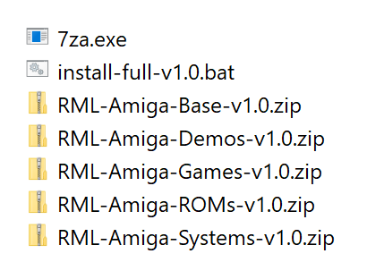

# Installation

The collection is split into five packs: **Base**, **Systems**, **ROMs**,
**Games**, and **Demos**.

You can download the packs from archive.org:

- [RML-Amiga-Base-v1.0](https://archive.org/details/RML-Amiga-Base-v1-0)
- [RML-Amiga-Systems-v1.0](https://archive.org/details/RML-Amiga-Systems-v1-0)
- [RML-Amiga-ROMs-v1.0](https://archive.org/details/RML-Amiga-ROMs-v1-0)
- [RML-Amiga-Games-v1.0](https://archive.org/details/RML-Amiga-Games-v1-0)
- [RML-Amiga-Demos-v1.0](https://archive.org/details/RML-Amiga-Demos-v1-0)

The total size of the packs is 16 GB for v1.0, and you'll need about 18 GB for
the installed collection. So about 36 GB of free disk space is needed to
install RML Amiga. 

If you're short on free space but you have multiple drives or partitions, you
can download the packs to one drive, then install to another. The installer
scripts allows you to install RML Amiga to a different drive or partition.

You can delete the packs after the installation if you want to reclaim disk
space.

## Automatic installation

The easiest way to set up RML Amiga is to use the automatic installation
method via the installer script.

1. Pick a destination folder for your RML Amiga installation. This must be
   outside of any system folders such as `C:\Program Files`. For example,
   `D:\Emulation\RML-Amiga` is a good location. 

1. Download all five packs into this folder.

1. Download the installation script `install-full-v1.0.bat` and the 7-zip
   archiver (`7za.exe`) from the
   [Base pack archive.org item](https://archive.org/download/RML-Amiga-Base-v1-0)
   into this folder as well. The contents of the folder should now look like
   this:

     <figure markdown="span">
       { width="70%" }
     </figure>

1. Double-click on `install-full-v1.0.bat` to start the installation and
   follow the instructions in the appearing window. Read the instructions
   carefully; you'll be able to specify an alternative installation location
   if you want to install RML Amiga to a different drive.

The installation will take about 15-20 minutes. It's a good idea to read the
[Why play Amiga games?](why-play-amiga-games.md) and [CRT
emulation](crt-emulation.md) sections while waiting.

Once the installation has been completed, you can delete the `RML-Amiga-*.zip`
packs to reclaim disk space. Moving them to a different folder for safekeeping
is an even better idea, though.

You can skip the rest of this section if you're eager to play some Amiga
games. Onward to the [Getting started](getting-started.md) section!

!!! note "RML Amiga is fully portable"

    RML Amiga uses relative paths and won't create or modify any files
    outside of its designated folder. You can move your RML Amiga folder
    between different drives or even different computers without any problems.

## About the packs

Here is a detailed description of the packs:

- **Base** --- Contains 64-bit versions of WinUAE, the CAPS IPF disk image
  plugin, a custom-compiled version of ReShade (with auto-updates and the nag
  screen disabled), and the CRT shader setup.

- **Systems** --- Minimal Workbench 1.3 and 3.1 hard drive setups as directory
  hard drives. Just the bare minimum required to run games (these files are
  included on many AmigaDOS floppy games as well). The Workbench 3.1
  installation contains WHDLoad too.

- **ROMs** --- Amiga Kickstart ROM images necessary to emulate
  the various Amiga models and the Roland MT-32 ROMs. (Note: The Amiga is
  *not* a console! Games are *not* called "ROMs" on the Amiga!)

- **Games** --- Nested ZIP archive with each game having its own
  self-contained ZIP file. Each game lives in its own dedicated subfolder
  which contains the disk images or directory hard drives, manuals, extras,
  save disks, save states, and the original source media.

- **Demos** --- Demoscene productions from the Amiga's glorious past (and
  present!). It's a nested ZIP archive, similar to the **Games** pack.

The folder structure in all packs is relative to the `$RML_BASE` folder. If
you expand all packages into `$RML_BASE` (double-expand in the case of the
**Games** and **Demos** packs), you'll get the correct folder structure.

!!! note "The practical reality we live in"

    The main reason for separating out the Kickstart ROMs and the minimal hard
    drive-based systems is to be able to share the collection on channels that
    don't want to risk harassment from the current rightsholders of the Amiga
    Kickstart ROMs.

    In a practical sense, no one gives a damn about these 30+ years old ROMs
    anymore, so whether you purchase them "legally" from the "current
    rightsholders" (who are far removed from Commodore and the original
    creators of the Amiga) or just download them from somewhere makes very
    little difference in the grand scheme of things. Up to you, really. If you
    decide to pay for them, make sure to purchase the full ROM set, not just
    the "value edition".

## Versioning & updates

"Point zero" package versions (e.g., v1.0, v2.0, etc.) always contain a
snapshot of all the files in the collection.

"Point release" packages (e.g., v1.1, v1.2. etc.) are updates; they need to be
applied in order. So, for example, if you're currently on **Games** v1.2 and
you want to upgrade to the latest v1.5 release, you'll need to apply the v1.3,
v1.4, and v1.5 update packages _in order_.

The **Games** and **Demos** packages will get the most frequent updates, the
rest only rarely.

## Manual installation

This is for people who want complete control over their installation (e.g., if
you don't want to download all games, just a few), and for those who have
problems with using certain parts of the collection for whatever reasons
(e.g., the Kickstart ROMs).

Start by downloading the **Base** and **Systems** packs---these are mandatory.
The **ROMs** pack is not necessary if you have acquired the ROM files from
elsewhere (see [Supplying your own ROM files](#supplying-your-own-rom-files)).

Once you've downloaded these packs, extract them into a folder you have full
write access to (e.g., `D:\Emulation\RML-Amiga`). We will refer to this folder
as `$RML_BASE` from now on. If you already have WinUAE installed, no problem.
The collection uses its own copy of WinUAE in portable mode, so it won't
interfere with existing installations. The included WinUAE will never save any
data outside of the `$RML_BASE` folder.

Now download the **Games** pack and `install-games-v1.0.bat`, then **Demos**
and `install-demos-v1.0.bat` if you're interested in watching glorious Amiga
demoscene productions. The scripts are not shown on the main page of the
archive.org items; you need to click on the "Show All" link in the "Downloads
options" box on the right side to see the full file list.

Move the packs and the scripts into `$RML_BASE`, then run
`install-games-v1.0.bat` and `install-demos-v1.0.bat` (the installation will
take about 15 minutes for the **Games** pack).

You can optionally pass the destination folder to the installer scripts as a
command line argument. This is handy if you're short on disk space, so you can
download the archives to one drive or partition and then install them to a
different one.

The stock configurations are set up for 1080p resolution. You'll need to use
the [Configuration tool](customising-your-setup.md/#configuration-tool) to
update all your configs to your monitor's resolution if you're running RML
Amiga on a better than 1080p screen (the [automated
installer](installation.md/#automatic-installation) does this step for you).
Make sure to check out the instructions in the [4K and better
monitors](customising-your-setup/#4k-and-better-monitors) section as well.

!!! note 

    The **Games** and **Demos** nested archives; each game and demo resides in
    its own ZIP archive inside the big ZIP archive. You'd need three times the
    disk space if you wanted to expand these manually. That's why using the
    installer scripts is recommended because the scripts will expand the
    nested ZIP files one by one, so you'll only need a bit more than twice the
    disk space.

!!! tip "Installing only a few games"

    Alternatively, you can grab only the games you're interested in. Each game
    resides in its own ZIP archive inside the big **Games** ZIP file. You can
    view the list of nested ZIP files on archive.org by clicking on the "Show
    All" link in the "Downloads options" box on the right side, then on the
    "View Contents" link next to the ZIP file's name in the file listing. That
    will take you to the list of nested ZIP archives which you can download
    individually by simply clicking on their names. Then you just simply need
    to unpack these ZIP files into `$RML_BASE`.

!!! warning "This voids your warranty, pal!"

    The games are only guaranteed to work with the bundled WinUAE version.
    Switching to any other version is asking for trouble---don't do it.

## Supplying your own ROM files

If you've acquired the ROM files from alternative sources, this is how to
install them.

### Kickstart ROMs

- The easiest way is to copy all your Amiga Kickstart ROM files into
  `$RML_BASE/ROMs`, then force a re-scan by pressing the **Rescan ROMs**
  button in the **Paths** WinUAE configuration tab. WinUAE will identify the
  ROM files by their CRC32 checksums, so the file names don't matter.

- To get WHDLoad working (required by a handful of games), copy the Amiga 500
  (Kickstart 1.3 rev 34.50) and Amiga 1200 (Kickstart 3.1 rev 40.60) ROMs into
  the `$RML_BASE/System-3.1/Devs/Kickstarts` folder, then rename them to
  `kick34005.A500.RTB` and `kick40068.A1200.RTB`, respectively (the below table
  shows their typical file names in Kickstart ROM collections).

These are all the ROM files used by setup with their CRC32 checksums:

| Filename                                                         | CRC32      |
| --------                                                         | -----      |
| Kickstart-v1.1-rev31.34-1985-Commodore-A1000.NTSC.rom            | `D060572A` |
| Kickstart-v1.2-rev33.166-1986-Commodore-A1000.rom                | `9ED783D0` |
| Kickstart-v1.3-rev34.50-1987-Commodore-A500-A1000-A2000-CDTV.rom | `C4F0F55F` |
| Kickstart-v3.1-rev40.68-1993-Commodore-A1200.rom                 | `1483A091` |
| Kickstart-v3.1-rev40.60-1993-Commodore-CD32.rom                  | `1E62D4A5` |
| CDTV Extended-ROM v2.7 (1992)(Commodore)(CDTV).rom               | `CEAE68D2` |
| CD32 Extended-ROM rev 40.60 (1993)(Commodore)(CD32).rom          | `87746BE2` |

### Roland MT-32 ROMs

These are only required by a handful of games that support Roland MT-32 sound.
You must copy these into `$RML_BASE\ROMs\mt32-roms\` and the file names must
match:

| Filename            | CRC32      | SHA-1                                      |
| --------            | -----      | -----                                      |
| ctrl_cm32l_1_02.rom | `B998047E` | `a439fbb390da38cada95a7cbb1d6ca199cd66ef8` |
| ctrl_mt32_1_07.rom  | `A7C1531B` | `b083518fffb7f66b03c23b7eb4f868e62dc5a987` |
| pcm_cm32l.rom       | `4B961EBA` | `289cc298ad532b702461bfc738009d9ebe8025ea` |
| pcm_mt32.rom        | `573E31CC` | `f6b1eebc4b2d200ec6d3d21d51325d5b48c60252` |

