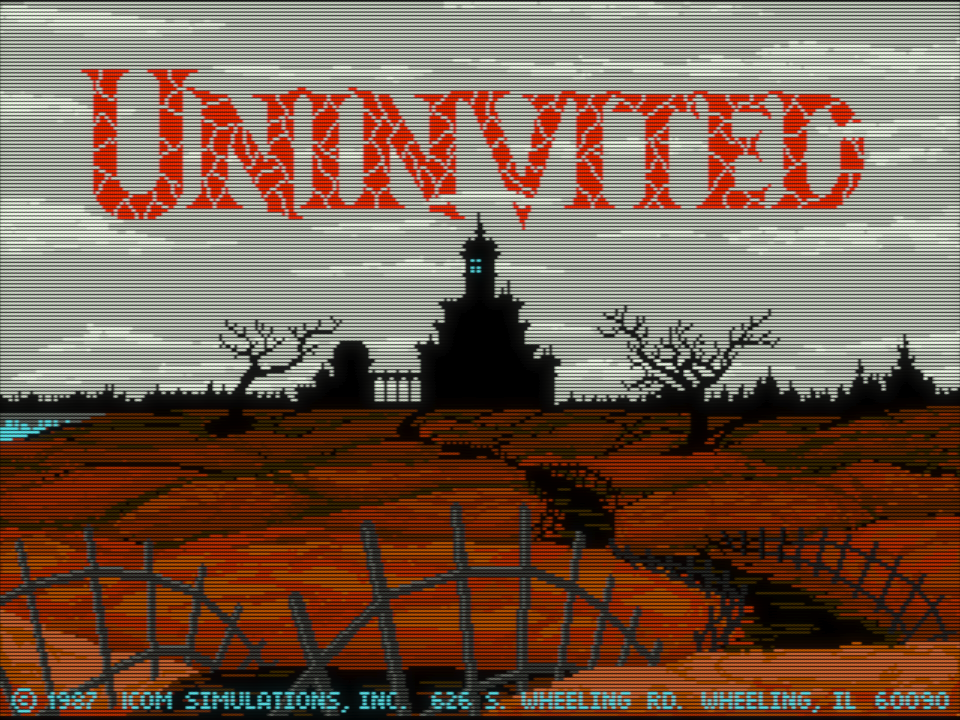

# Why play Amiga games?

Apart from Amiga-exclusive titles, most of the games in RML Amiga have also
been released for MS-DOS. So what's the point then, you might ask; why prefer
Amiga originals or ports over the DOS versions?

## A short history 

The first Amiga was released in 1985 and it had unsurpassed graphics and sound
capabilities for a very long time. As the Computer History Museum put it, it
was "a radical multimedia machine from a group of thinkers, tinkerers, and
visionaries which delivered affordable graphics, animation, music, and
multitasking interaction the personal computer world hadn’t even dreamt of."
That's a pretty accurate summary; the Amiga was at least a good 10 years ahead
of its time.

IBM PCs from that era cost a small fortune, could only display 16 garish
colours at best, and had rather primitive sound capabilities. The Amiga could
display 64 colours out of its 4096-colour palette (or even hundreds of colours
with clever programming tricks, or all 4096 colours at once in a special video
mode), and had 4-channel digital sound---all that at a fraction of what an IBM
PC costed[^1]. Although early models only had a 7.14 MHz CPU, all Amigas were also
equipped with custom graphics and sound chips (co-processors) that worked in
parallel with the CPU, freeing it up to do other tasks. This is similar to how
modern GPUs operate.

In contrast, IBM PCs running MS-DOS had to do everything on the CPU by
brute force. VGA graphics adapters and Sound Blaster cards were rather "dumb"
compared to the sophisticated custom chips of the Amiga capable of
semi-autonomous operation, so they needed a lot of CPU horsepower to drive.
You needed a pretty fast decked-out Pentium to even just approximate what the
original Amiga 1000 from 1985 was capable of. Although the Gravis UltraSound
and Sound Blaster AWE32 cards eventually far surpassed the audio capabilities
of the Amiga, they came late to the party and thus were sadly not widely
utilised in DOS games.

## Amiga vs DOS versions

In practical terms, any game released before 1990 has the potential to be
vastly better on the Amiga. We're talking about "potentials" here because
there were many lazy Amiga ports of technically inferior DOS and Atari ST
games, done by developers who did not understand the platform and thus did not
utilise it to the fullest (Sierra is the most well-known example). But even
these low-effort ports usually have superior sound on the Amiga.

In the early 1990s, when 386DX/40 or better machines equipped with VGA and
Sound Blaster became the minimum standard in gaming circles, DOS games started
catching up with the Amiga. Due to the relative unpopularity of the Amiga in
the USA, North American game developers started dropping Amiga support from
1990 onwards. Many post-1990 North American Amiga releases are nothing to
write home about; most of them are low-effort ports of the DOS originals.

The situation in Europe, however, was the exact opposite. The Amiga was vastly
more successful there than IBM PCs right until the mid-90s when Windows 95
eventually took over (the German and the UK markets accounted for about
60% of total worldwide Amiga sales). Most European developers either adopted an
"Amiga-first" approach, or at the very least properly utilised the strengths
of the platform in their multi-platform releases. The biggest differentiating
factor is usually the sound: even games made in the late 1993-1995 period have
really good music and sound effects on the Amiga via digital samples of real
instruments, while the DOS port often only has synthetic-sounding AdLib/OPL
music, no sound effects, or some generic MIDI conversion of the original Amiga
music.

---

<figure markdown="span">
  
  <figcaption>Uninvited (Amiga, 1987)</figcaption>
</figure>

<figure markdown="span">
  

  <figcaption>Uninvited (DOS, CGA, 1988)</figcaption>
</figure>

<figure markdown="span">
  
  <figcaption>It Came From the Desert (Amiga, 1989)</figcaption>
</figure>

<figure markdown="span">
  
  <figcaption>It Came From the Desert (DOS, EGA, 1990)</figcaption>
</figure>

## General recommendations

In short, for pre-1990 games, it's not even a contest---the Amiga almost
always wins on all fronts. From 1990 onwards, it varies per game, but in
general, European-made games are often best on the Amiga. Then regardless of
the year of release, the Amiga versions are often the best-sounding, or at
least they offer something unique in the sound department compared to the OPL
or MIDI audio of their DOS counterparts. On the other hand, you often get
better FPS in DOS versions of 3D games because these just need the raw CPU power
for software 3D rendering that stock Amigas did not have.

## Further reading

If you would like to learn more about the fascinating history of the Amiga, 
make sure to check out this [epic eight-part article series](https://arstechnica.com/gadgets/2015/07/the-amiga-turns-30-nobody-had-ever-designed-a-personal-computer-this-way/) or get the book [The Future Was Here: The Commodore Amiga](https://mitpress.mit.edu/9780262535694/the-future-was-here/).

If you're interested in the rise and fall of the Amiga gaming in relation to
DOS, check out [my
article](https://blog.johnnovak.net/2023/01/02/gaming-on-the-amiga-part-1-amiga-500-is-all-you-need/)
on the subject.

[^1]: An Amiga 500 with a Commodore 1084S RGB monitor with reasonably good
    quality built-in stereo speakers cost about $800 in 1988. You could only
    get a no-name IBM PC clone with a 286 CPU and no monitor for the same
    amount of money. A still no-name 286 with an EGA monitor and hard drive
    cost about $1400-1800, and the VGA monitor option would set you back by
    $1700-$2100. And after spending all that money, your brand new machine
    still had no sound card, only a small crappy built-in speaker that was
    mostly only capable of producing primitive monotonic beeps...
